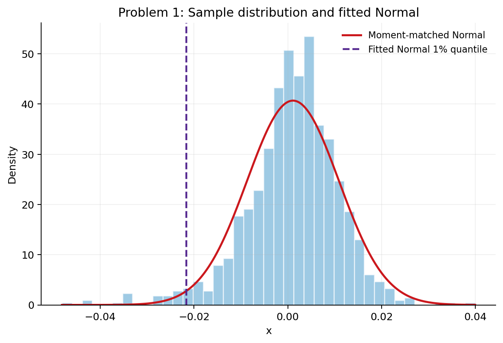
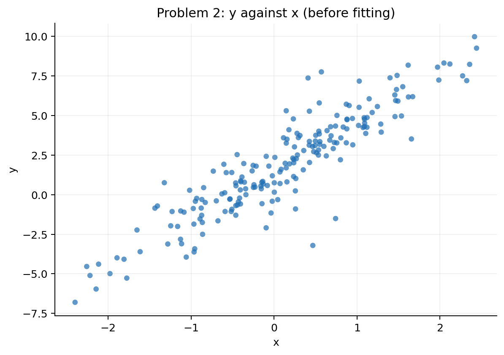
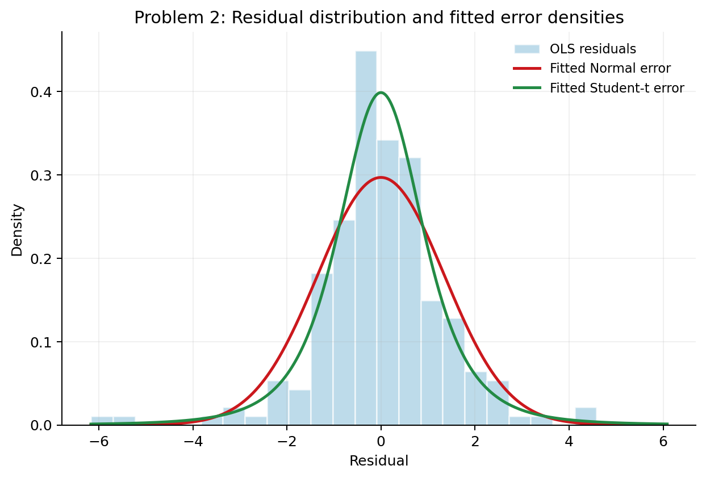
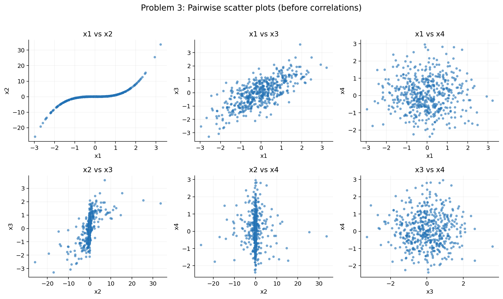
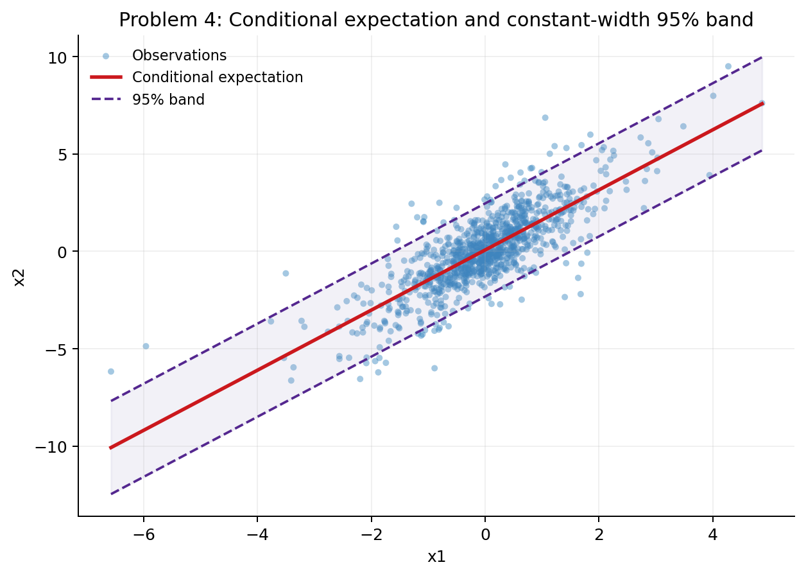
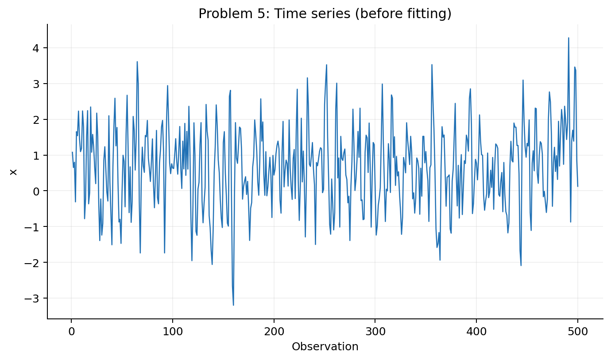
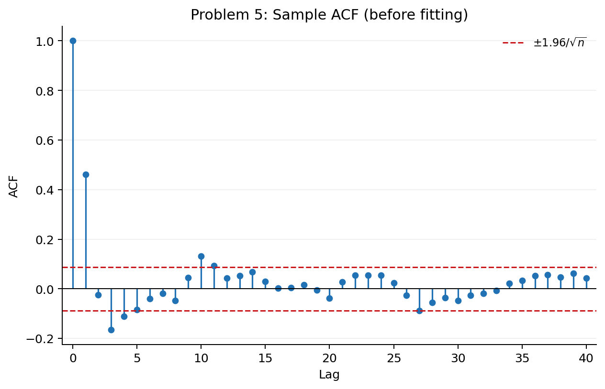
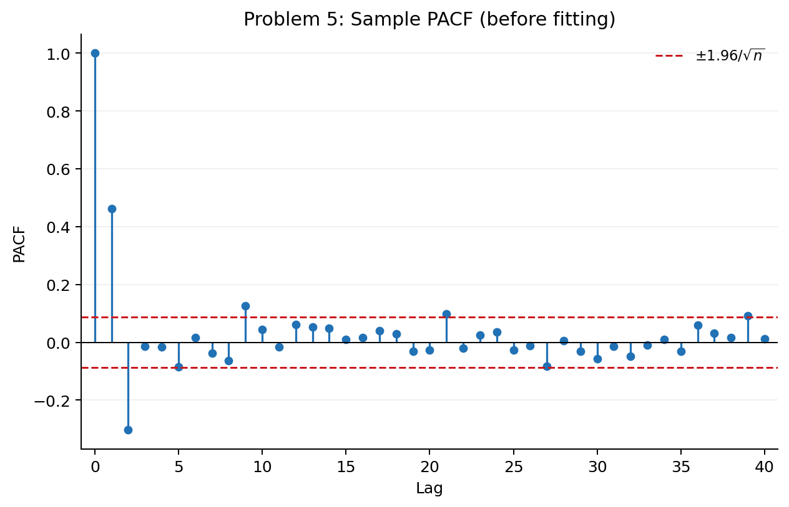

# Assignment 1 - Univariate and Multivariate Statistics

**FinTech 545 - Quantitative Risk Management**

**Yukai Li**

## 1. Reading the Shape of a Sample

### Predict

**Part (a).**

The first four sample moments are:

| Moment | Estimate |
|---|---:|
| Mean | 0.00110439 |
| Sample variance | 0.0000962482 |
| Standardized skewness | -0.669837 |
| Excess kurtosis | 2.357614 |

The negative skewness indicates asymmetry toward the left, while the positive
excess kurtosis indicates heavier tails than a Normal distribution. A Normal
distribution is inconsistent with both features because it has zero skewness
and zero excess kurtosis. A symmetric Student's t distribution can account for
the positive excess kurtosis, but not the negative skewness. A lognormal
distribution is also inconsistent with the sample because its skewness is
positive. The normal inverse Gaussian (NIG) distribution remains plausible
because it can accommodate both skewness and heavy tails.

### Fit

**Part (b).**

I fit a Normal distribution by matching the sample mean and sample variance:

$$
X \sim N(0.00110439,\;0.0000962482).
$$

The fitted standard deviation is 0.00981062, which gives a 1% quantile of
-0.02171852. There are 26 observations below this threshold. Under the fitted
Normal, the expected count is

$$
1000(0.01)=10.
$$

The empirical proportion below the fitted 1% quantile is therefore 2.6%.

*Figure 1. The sample distribution, moment-matched Normal density, and fitted
Normal 1% quantile.*

### Reconcile

**Part (c).**

The fitted Normal places too little probability in the left tail. A threshold
that should be crossed about 10 times is crossed 26 times. This agrees with the
negative skewness and positive excess kurtosis seen before fitting: the Normal
model understates downside tail risk for this sample.

## 2. A Regression Whose Errors Are Not Normal

### Predict

**Parts (a) and (b).**

The scatter is roughly linear with a strong positive relationship, but a few
observations sit much farther from the main pattern than I would expect under a
Normal error. I therefore expect a heavy-tailed error distribution, such as
Student's t, to fit better. This violates OLS assumption 7, Normal errors.
Because OLS gives large residuals substantial weight, I also expect the unusual
observations to move the slope somewhat. I expect the large residuals to
increase the estimated residual variance and make the conventional standard
error of the slope larger. Normal-based inference may also be less reliable.

*Figure 2. The y-versus-x scatter viewed before fitting any regression model.*

### Fit

I estimated OLS, a Normal-error maximum-likelihood regression, and a
Student's-t-error maximum-likelihood regression. The Student's t model uses
the parameterization

$$
\varepsilon \sim t(\nu,\;\text{location}=0,\;\text{scale}=s),
$$

where the fitted scale is not the standard deviation.

| Model | Alpha | Beta | Error parameters | Log likelihood | AICc |
|---|---:|---:|---|---:|---:|
| OLS | 1.560740 | 2.990757 | SE(alpha) = 0.096269; SE(beta) = 0.096640 | - | - |
| Normal MLE | 1.560740 | 2.990757 | sigma = 1.344627 | -343.011037 | 692.144523 |
| Student's t MLE | 1.547979 | 3.019179 | scale = 0.935509; nu = 3.632165 | -328.561179 | 665.327487 |

For the Normal model, the AICc parameter count is 3: alpha, beta, and sigma.
For the Student's t model, it is 4: alpha, beta, scale, and nu. I calculated
AICc as

$$
\mathrm{AICc}=2k-2\log L+\frac{2k^2+2k}{n-k-1}.
$$

The Student's t model lowers AICc by 26.817036 points.

*Figure 3. OLS residuals with the fitted Normal and Student's t error densities.*

### Reconcile

**Part (c).**

My prediction overstated the effect of the unusual observations on the slope.
The OLS slope is 2.99076 and the Student's t slope is 3.01918, a difference of
only about 0.0284. The central regression relationship barely changes.

**Part (d).** The rejected Normal model is getting the residual tails wrong,
not the central slope. The Student's t likelihood assigns more probability to
the unusually large errors, which is why its AICc is substantially lower.

**Part (e).**

The fitted positive error quantiles are:

| Quantile | Normal error | Student's t error |
|---|---:|---:|
| 95% | 2.211715 | 2.053833 |
| 99.5% | 3.463530 | 4.620085 |

The Student's t fit has a smaller scale and more mass near the center, so its
95% quantile is slightly below the Normal quantile. Farther into the tail, its
low fitted degrees of freedom dominate, making the 99.5% quantile much larger.
For a capital buffer, I would use the Student's t model because the extreme
tail is the relevant risk.

## 3. Pearson Against Spearman

### Predict

**Part (a).**

The x1/x2 scatter is strongly monotonic but visibly nonlinear, with an
approximately cubic shape. I expect that pair to produce the largest
Pearson-Spearman disagreement. The x1/x3 relationship looks closer to linear,
and the pairs involving x4 show little systematic association, so I expect the
two measures to agree more closely for those pairs. The x2/x3 plot also appears
monotonic but somewhat nonlinear, so I expect some disagreement there, although
less than for x1/x2.

*Figure 4. All pairwise scatter plots, viewed before calculating either
correlation matrix.*

### Fit

**Part (b).**

The Pearson correlation matrix is:

| | x1 | x2 | x3 | x4 |
|---|---:|---:|---:|---:|
| x1 | 1.000000 | 0.799092 | 0.719467 | -0.004680 |
| x2 | 0.799092 | 1.000000 | 0.587614 | -0.020923 |
| x3 | 0.719467 | 0.587614 | 1.000000 | -0.008605 |
| x4 | -0.004680 | -0.020923 | -0.008605 | 1.000000 |

The Spearman correlation matrix is:

| | x1 | x2 | x3 | x4 |
|---|---:|---:|---:|---:|
| x1 | 1.000000 | 0.971930 | 0.683910 | 0.000189 |
| x2 | 0.971930 | 1.000000 | 0.667422 | -0.001131 |
| x3 | 0.683910 | 0.667422 | 1.000000 | -0.002422 |
| x4 | 0.000189 | -0.001131 | -0.002422 | 1.000000 |

The largest absolute gap is for x1/x2:

$$
|0.799092-0.971930|=0.172838.
$$

### Reconcile

**Part (c).**

The result matches the shape visible in the pair plot. Spearman works with
ranks, so a strong monotonic relationship can produce a value near one even
when the curve is nonlinear. Pearson measures linear association and is lower
because a straight line does not fully describe the cubic shape. Spearman is
the more direct description if the question is whether x2 moves monotonically
with x1. Pearson answers the different question of how strong their linear
association is. Neither coefficient is intrinsically wrong.

## 4. Conditional Distributions

### Predict

**Part (a).**

Using the n-1 sample covariance convention, the covariance matrix for
$(X_1,X_2)$ is

$$
\Sigma=
\begin{bmatrix}
1.099875 & 1.696902\\
1.696902 & 4.104749
\end{bmatrix}.
$$

Here, $\Sigma_{11}=\operatorname{Var}(X_1)$,
$\Sigma_{22}=\operatorname{Var}(X_2)$, and
$\Sigma_{21}=\Sigma_{12}=\operatorname{Cov}(X_2,X_1)$. Under the multivariate
Normal model,

$$
\operatorname{Var}(X_2\mid X_1)
=\Sigma_{22}-\Sigma_{21}\Sigma_{11}^{-1}\Sigma_{12}.
$$

For this sample, the conditional variance is 1.486746. The fraction of the
original variance that remains is

$$
\frac{\Sigma_{22}-\Sigma_{21}\Sigma_{11}^{-1}\Sigma_{12}}
{\Sigma_{22}}
=0.362201.
$$

Learning $X_1$ therefore reduces the variance by about 63.78%.

**Part (b).** The factor is constant under the multivariate Normal model. The
conditional variance formula contains no observed $x_1$ term, which settles
the question before examining coverage in the data.

### Fit

**Part (c).**

The conditional mean formula is

$$
E[X_2\mid X_1=x_1]
=\mu_2+\frac{\Sigma_{21}}{\Sigma_{11}}(x_1-\mu_1).
$$

The sample means are $\mu_1=-0.016714$ and $\mu_2=0.045288$, and

$$
\frac{\Sigma_{21}}{\Sigma_{11}}=1.542813.
$$

Thus the fitted linear expression is

$$
\widehat{E[X_2\mid X_1=x_1]}=0.071073+1.542813x_1.
$$

The coefficient 1.542813 is also the OLS slope from regressing x2 on x1. The
conditional standard deviation is 1.219322, so the constant-width 95% band is
the fitted line plus or minus $1.96(1.219322)$.

*Figure 5. Conditional linear expression with the multivariate-Normal
constant-width 95% band.*

**Parts (d) and (e).**

Overall, 935 of the 1,000 observations lie inside the band, for 93.5% coverage.
Splitting the sample by the distance of x1 from its mean gives:

| x1 distance from its mean | Observations | Inside band | Coverage |
|---|---:|---:|---:|
| At most 1 sample SD | 759 | 726 | 95.652174% |
| More than 1 and at most 2 sample SDs | 190 | 163 | 85.789474% |
| More than 2 sample SDs | 51 | 46 | 90.196078% |

### Reconcile

**Part (f).**

The coverage is not flat across the three buckets. In particular, it falls
well below 95% in the middle bucket. This indicates that the constant
conditional variance implied by joint Normality is not a good description of
the data.

The covariance-based coefficient still survives as the coefficient of the
best linear predictor. Once joint Normality fails, however, the fitted linear
expression is not guaranteed to be the exact conditional expectation, and the
constant-width Normal band is not guaranteed to provide 95% conditional
coverage at every value of x1.

## 5. Identifying an AR or MA Order

### Predict

**Parts (a) and (b).**

The time-series plot appears stationary around a stable level. The ACF decays
and oscillates rather than cutting off after a fixed lag. The PACF has strong
spikes at lags 1 and 2, followed mostly by values inside the significance band

$$
\pm\frac{1.96}{\sqrt{500}}=\pm0.08765.
$$

There is an isolated significant PACF spike near lag 9, but it is not part of a
persistent cutoff pattern. Using the rule that an AR($p$) process has a
decaying ACF and a PACF that cuts off after lag $p$, my pre-fit choice is AR(2).

*Figure 6. The time series viewed before fitting candidate AR and MA models.*

*Figure 7. Sample ACF with the constant plus-or-minus 0.08765 significance
band.*

*Figure 8. Sample PACF with the same significance band.*

### Fit

**Part (c).**

All six models include the same constant-mean treatment and use the same exact
Gaussian state-space likelihood convention. The manually calculated AICc
values are:

| Model | AICc |
|---|---:|
| AR(1) | 1418.586959 |
| AR(2) | 1372.438310 |
| AR(3) | 1374.343211 |
| MA(1) | 1389.084281 |
| MA(2) | 1381.231619 |
| MA(3) | 1374.116525 |

The minimum is AR(2). Its fitted coefficients are

$$
\phi_1=0.601201,\qquad \phi_2=-0.302638.
$$

For comparison, AR(3) estimates

$$
\phi_1=0.596204,\qquad
\phi_2=-0.292690,\qquad
\phi_3=-0.016542.
$$

The AR(2) and AR(3) log likelihoods are -682.178751 and -682.110877,
respectively. Their AICc values are 1372.438310 and 1374.343211.

### Reconcile

**Part (d).**

The AICc selection agrees with the AR(2) choice made from the ACF and PACF.

**Part (e).**

The third AR coefficient is only about -0.0165, and adding it produces a very
small likelihood improvement. AICc rejects AR(3) because that gain does not
justify the additional parameter. Ordinary $R^2$ does not impose the same
complexity penalty. It cannot decrease
when another regressor is added, so it would not make the same tradeoff between
the small in-sample improvement and the extra parameter.
