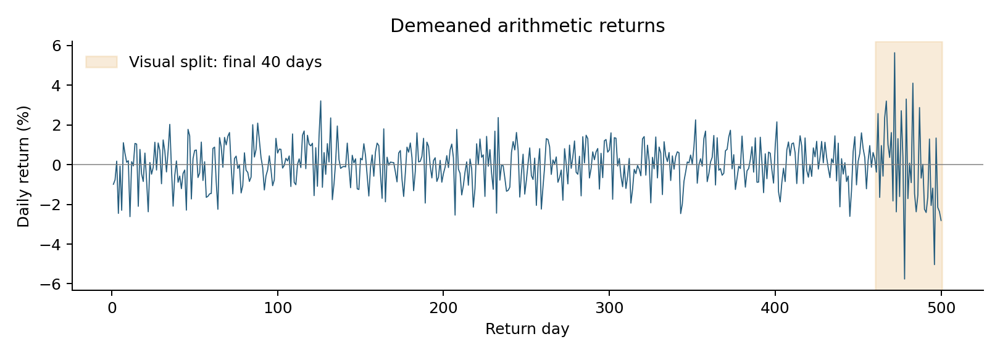
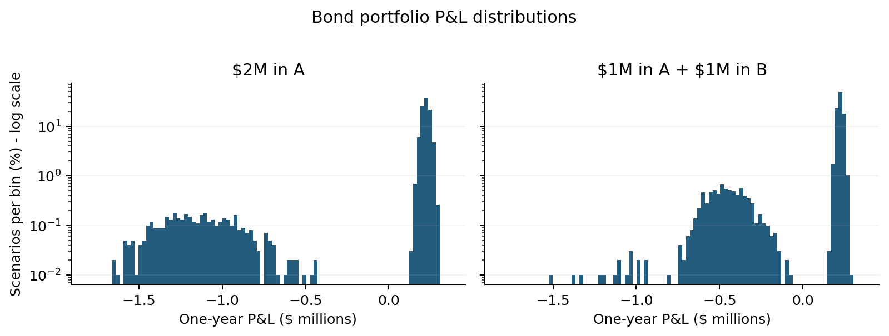
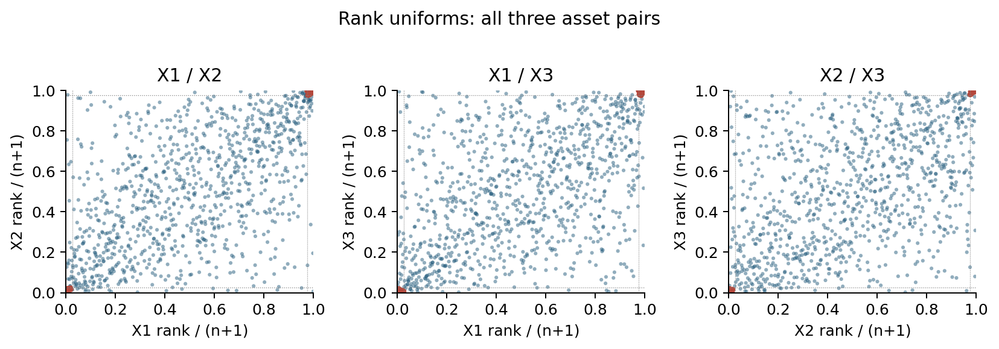

```{python}
#| include: false
import json
from pathlib import Path
import numpy as np
from IPython.display import display, Markdown
r = json.loads(Path("results.json").read_text(encoding="utf-8"))
p1, p2, p3, p4, p5 = [r[f"p{i}"] for i in range(1,6)]
def f(x, digits=4):
    if abs(x) < 0.5*10**(-digits):
        x = 0.0
    return f"{x:.{digits}f}"
def pct(x, digits=2):
    return f"{100*x:.{digits}f}%"
def money(x):
    return f"${x:,.0f}" if x >= 0 else f"-${abs(x):,.0f}"
def sci(x):
    return f"{x:.6e}"
def table(headers, rows):
    lines = ["| " + " | ".join(h.replace("$", "\\$") for h in headers) + " |",
             "|" + "|".join([":---"] + ["---:"]*(len(headers)-1)) + "|"]
    for row in rows:
        lines.append("| " + " | ".join(str(v).replace("$", "\\$") for v in row) + " |")
    display(Markdown("\n".join(lines)))
def matrix_table(names, values, digits=6):
    table([""]+names, [[name]+[f(v,digits) for v in row] for name,row in zip(names,values)])
def moment_table(values):
    table(["Series", "Mean", "Variance", "Skewness", "Excess kurtosis"],
          [[name, f(v["mean"],6), sci(v["variance"]), f(v["skewness"]), f(v["excess_kurtosis"])]
           for name,v in values.items()])
```

## Conventions

Returns are arithmetic, $r_t=P_t/P_{t-1}-1$, expressed as decimals unless a
percentage is shown. For dollar exposures $v$, portfolio P&L is $v^T r$.
I use the **loss convention**

$$
\operatorname{VaR}_{\alpha}(P\&L)=-q_\alpha(P\&L),\qquad
\operatorname{ES}_{\alpha}(P\&L)=-E[P\&L\mid P\&L\le q_\alpha].
$$

Thus positive numbers denote losses. A negative VaR denotes a gain at the
quantile; I do not take an absolute value or floor it at zero. This distinction
matters for the bonds in Problem 3. The default tail probability is 5%.
Problems 2, 4, and 5 concern one day; Problem 3 concerns one year.

Historical and simulated risk follow `library/RiskStats.jl`. After sorting
$n$ P&Ls, the quantile is the average of the observations numbered
$\lfloor n\alpha\rfloor$ and $\lceil n\alpha\rceil$, using one-based indices.
Here $n\alpha$ is always an integer, so this is just that order statistic.
ES averages all observations at or below it. There are no boundary ties in
these calculations. Historical estimates use the supplied scenarios directly,
without adding bootstrap sampling noise.

Descriptive variance and standard deviation use divisor $n-1$. Skewness is
$m_3/m_2^{3/2}$ and **excess** kurtosis is $m_4/m_2^2-3$, where
$m_j=n^{-1}\sum_i(x_i-\bar x)^j$. This matches the uncorrected standardized
moment convention discussed in Week 1. Normal MLE scale instead uses divisor
$n$. Student $t$ scale is its location-scale parameter, not its standard deviation.

The predictions below were recorded after the allowed descriptive summaries
and plots, before correlations, model fits, VaR, or ES were computed. They are
retained even when the results disagree. `assignment2.py` computes all tables
and figures; this report reads its numerical output. Each required simulation
uses exactly `{python} f(r['nsim'],0)` draws with seed `{python} r['seed']`.

# Problem 1: Correlations from Mismatched Histories

## Predict

The joint observation counts are as follows. Diagonal entries are each series'
available history. Only **`{python} p1['complete_n']`** rows contain all five series.

```{python}
#| results: asis
table([""]+p1["names"], [[name]+row for name,row in zip(p1["names"],p1["counts"])])
```

**(a) Which estimator is guaranteed PSD?** Complete-case correlation is PSD.
If $Z$ contains centered, standardized complete observations, its correlation
matrix is $Z^T Z/(n_c-1)$. For every vector $a$,
$a^T Z^T Za/(n_c-1)=\|Za\|^2/(n_c-1)\ge0$. This is a common data matrix for
every entry. Pairwise deletion uses different rows, means, and standard
deviations for different pairs. Individually valid correlations can then be
mutually inconsistent, with no single Gram matrix behind them. Pairwise
correlation can therefore have a negative eigenvalue. PSD does not by itself
guarantee strictly positive eigenvalues or an ordinary Cholesky factorization.

**(b) Why is this data set exposed?** With exact index replication,
$r_{IDX}-.4r_A-.3r_B-.2r_C-.1r_D=0$. The covariance matrix would have a
nonzero null vector and a zero eigenvalue. Rescaling by nonzero standard
deviations preserves rank, so correlation would also be singular. Small
tracking error makes the smallest true eigenvalue small and positive rather
than exactly zero. The matrix is therefore close to the PSD boundary: relatively
small incompatible estimation errors can push this eigenvalue below zero.
Strong index-stock relationships do not protect against that failure.

**(c) Which estimates are least reliable?** My prediction is that correlations
involving D will be least reliable, especially C-D, with only
`{python} p1['counts'][3][4]` joint observations. D has a short listing history,
and C's holidays reduce their overlap further. D's history also represents a
different calendar window, so any time variation in dependence matters as well
as sample size. A and B share `{python} p1['counts'][1][2]` days and should be
more stable. Complete-case estimation puts even these longer histories on the
same short sample; its PSD guarantee comes at an information cost.

## Fit

**(d) Original correlation matrices, spectra, and Cholesky.** The complete-case
correlation matrix, using the common rows only, is:

```{python}
#| results: asis
matrix_table(p1["names"],p1["matrices"]["Complete case"]["matrix"])
```

The pairwise correlation matrix, before any repair, is:

```{python}
#| results: asis
matrix_table(p1["names"],p1["matrices"]["Pairwise"]["matrix"])
```

Eigenvalues below are ordered from smallest to largest. Computations use the
unrounded matrices; rounding a nearly singular matrix before factorization can
change the result.

```{python}
#| results: asis
table(["Eigenvalue", "Complete case", "Pairwise"],
      [[str(i+1),sci(p1["matrices"]["Complete case"]["eigenvalues"][i]),
        sci(p1["matrices"]["Pairwise"]["eigenvalues"][i])] for i in range(5)])
```

The complete-case minimum is `{python} sci(p1['matrices']['Complete case']['min_eigenvalue'])`;
ordinary NumPy Cholesky **succeeds**. Its largest reconstruction error is
`{python} sci(p1['matrices']['Complete case']['cholesky_error'])`.
The pairwise minimum is `{python} sci(p1['matrices']['Pairwise']['min_eigenvalue'])`;
ordinary Cholesky **fails: the matrix is not positive definite**. This negative
eigenvalue is far too large to dismiss as floating-point error.

**(e) Full-history scaling and tracking variance.** Let $D_s$ contain each
series' full-history sample standard deviation. The required covariance is
$\Sigma=D_s C_{PW}D_s$, rather than a direct table of pairwise covariances.
The standard deviations used are:

```{python}
#| results: asis
table(["Series", "Full-history standard deviation"],
      [[name,f(sd,8)] for name,sd in zip(p1["names"],p1["std_full"])])
```

In the order IDX, A, B, C, D,

$$
w=(1,-0.4,-0.3,-0.2,-0.1)^T,\qquad
\operatorname{Var}(w^Tr)=w^T\Sigma w.
$$

The calculated variance is **`{python} sci(p1['matrices']['Pairwise']['tracking_variance_full_sd'])`**
in squared-return units. A negative variance is invalid, even though each
individual standard deviation and pairwise correlation looks admissible.

**(f) Two repairs.** Rebonato-Jackel uses the spectral construction from Week 3:
clip negative eigenvalues of $C_{PW}=Q\Lambda Q^T$ to zero, set
$B=Q\sqrt{\Lambda_+}$, normalize each row of $B$ to unit length, and return
$BB^T$. This restores the diagonal but does not generally minimize distance.

Higham solves $\min_C\|C-C_{PW}\|_F$ subject to $C\succeq0$ and
$\operatorname{diag}(C)=1$, with $W=I$. I use the course's alternating PSD and
unit-diagonal projections with the Dykstra correction. The squared-distance
change and minimum-eigenvalue tolerance are both tightened to $10^{-12}$.
Convergence takes `{python} p1['higham_iterations']` iterations. In both
repairs, the full-history standard deviations remain fixed.

```{python}
#| results: asis
table(["Repair", "Minimum eigenvalue", "Frobenius distance", "Tracking variance"],
      [[name,sci(p1["matrices"][name]["min_eigenvalue"]),
        f(p1["matrices"][name]["distance_from_pairwise"],8),
        sci(p1["matrices"][name]["tracking_variance_full_sd"])]
       for name in ["Rebonato-Jackel","Higham"]])
```

Both matrices are PSD within numerical tolerance, and both tracking variances
are positive. Higham's very small negative eigenvalue is its stopping tolerance,
not the economically meaningful negative eigenvalue of the original matrix.
These repairs lie near the PSD boundary; strict positive definiteness is not
their objective.

## Reconcile

**(g) Why the negative variance proves failure.** The definition of PSD is
$a^T\Sigma a\ge0$ for **every** vector $a$. The tracking weights provide an
explicit counterexample. Equivalently, $w^TD_s C_{PW}D_sw$ is a negative
quadratic form of the pairwise correlation matrix. There is no real-valued
random portfolio with negative variance, so this is an inconsistency in the
estimated dependence structure, not an unusually effective hedge. The
complete-case PSD result and the failure of pairwise Cholesky match my prediction.

**(h) Where Higham makes the changes.** The following lists every distinct
off-diagonal entry, sorted by absolute change. Its symmetric partner moves by
the same amount.

```{python}
#| results: asis
table(["Pair", "Joint days", "Original", "Higham", "Change"],
      [[v["pair"],v["count"],f(v["before"],6),f(v["after"],6),f(v["change"],6)]
       for v in p1["higham_changes"]])
```

The largest adjustments are IDX-A, IDX-C, and IDX-B, rather than C-D. In
part (c), I identified sampling reliability; Higham addresses global algebraic
consistency. The index is almost spanned by the stock basket, so its high
correlations load heavily on the nearly null direction. Reducing those entries
helps remove the negative eigenvalue with relatively little total squared
movement. The objective treats all entries with equal weight and knows neither
their observation counts nor their sampling errors. A heavily sampled entry can
therefore move more than a weakly sampled one. The repair restores feasibility;
it does not certify which empirical estimate is statistically best.

**(i) Estimator choice versus repair choice.**

```{python}
#| results: asis
table(["Comparison", "Frobenius distance"],
      [["Pairwise versus complete case",f(p1["estimator_gap"],8)],
       ["Rebonato-Jackel versus pairwise",f(p1["matrices"]["Rebonato-Jackel"]["distance_from_pairwise"],8)],
       ["Higham versus pairwise",f(p1["matrices"]["Higham"]["distance_from_pairwise"],8)],
       ["Rebonato-Jackel versus Higham",f(p1["repair_method_gap"],8)]])
```

The estimator gap is about
`{python} f(p1['estimator_gap']/p1['matrices']['Higham']['distance_from_pairwise'],1)`
times the Higham repair distance. **The choice of estimator matters much more
for these data than the choice between the two repairs.** Higham improves the
distance modestly, and the two repaired tracking variances are almost identical.
The larger substantive choice is whether to discard most of the longer
histories to force a common sample. This does not make repair optional: the
unrepaired pairwise matrix remains invalid regardless of how small its repair is.

\newpage

# Problem 2: A Volatility Estimate After the Regime Changed

## Predict

I compute `{python} p2['n']` returns and subtract their sample mean,
`{python} f(p2['removed_mean'],8)`. The plot shows a visibly wider range of
moves near the end. Before fitting, I choose the last
`{python} p2['recent_days']` observations, days
`{python} p2['regimes'][1]['days']`, as an approximate new regime. This is a
visual boundary, not an estimated change point.

{width=100%}

**(a) Predicted ordering, smallest to largest.** My original prediction is:

$$
\text{Historical}<t\text{ MLE}<\text{Normal, equal weight}
<\text{EW Normal }(.97)<\text{EW Normal }(.94).
$$

Historical simulation gives most weight to the older quiet period. I expect a
$t$ fit to keep a relatively narrow center while accommodating a few extremes,
whereas an equal-weight normal spreads their contribution to variance across
its entire distribution. EW estimates should be larger because they emphasize
the recent turbulent period; .94 should respond more strongly than .97.
The historical-versus-$t$ ordering is the least certain part of this prediction:
a 5% quantile is not determined by kurtosis alone.

**(b) Memory of the EW estimator.** Following `library/ewCov.jl`, observation
$t=1,\ldots,n$ receives

$$
\hat w_t=\frac{(1-\lambda)\lambda^{n-t}}{1-\lambda^n},\qquad
\bar x_w=\sum_t\hat w_tx_t,\qquad
\hat\sigma_w^2=\sum_t\hat w_t(x_t-\bar x_w)^2.
$$

The newest observation has the largest weight. Although the full sample is
demeaned first, its EW mean is generally nonzero; the course covariance routine
removes that EW mean as well. No additional unbiasedness correction is applied.
The quantities requested are

$$
n_{\rm eff}=\frac1{\sum_t\hat w_t^2}
=\frac{1+\lambda}{1-\lambda}\frac{1-\lambda^n}{1+\lambda^n},\quad
h=\frac{\log(0.5)}{\log\lambda},\quad
W_{\rm recent}=\frac{1-\lambda^{40}}{1-\lambda^{500}}.
$$

```{python}
#| results: asis
table(["Lambda", "Finite n_eff", "Infinite n_eff", "Half-life (days)", "Recent weight"],
      [[f(v["lambda"],2),f(v["n_eff"],4),f(v["n_eff_infinite"],4),
        f(v["half_life"],2),pct(v["recent_weight"])] for v in p2["ew"].values()])
```

The final 40 days receive `{python} pct(p2['ew']['0.94']['recent_weight'])`
of the .94 weight and `{python} pct(p2['ew']['0.97']['recent_weight'])` of
the .97 weight, compared with `{python} pct(p2['recent_days']/p2['n'])` under
equal weighting. The .94 estimate is consequently much closer to a measure of
the recent regime than to a summary of all 500 days.

**(c) First four moments and the single-regime prediction.**

```{python}
#| results: asis
moment_table({"Original returns":p2["raw_moments"],"Demeaned returns":p2["moments"]})
```

Demeaning changes only the first moment. Excess kurtosis of
`{python} f(p2['moments']['excess_kurtosis'])` is well above the normal value
of zero, while skewness is comparatively modest. I would not regard one
homoskedastic normal regime as a reasonable explanation of the sample. A normal
sample can have nonzero sample kurtosis by chance, but the time plot provides
an additional explanation: periods with different variances are being pooled.

## Fit

**(d) Five one-day VaRs.** Normal VaR uses
$10^6z_{0.95}\hat\sigma$ with zero mean after demeaning. Student $t$ MLE
estimates location as well as scale and degrees of freedom on these same
demeaned observations, so its small fitted location is retained in its quantile:

$$
\operatorname{VaR}_{t}=-10^6\left(\hat\mu_t+\hat s_t\,t_{\hat\nu}^{-1}(0.05)\right).
$$

```{python}
#| results: asis
table(["Method", "One-day 5% VaR ($)"], [[name,money(value)] for name,value in p2["var"].items()])
table(["t parameter", "MLE"], [["Degrees of freedom",f(p2["t_fit"]["nu"],6)],
      ["Location",f(p2["t_fit"]["location"],8)],["Scale",f(p2["t_fit"]["scale"],8)]])
table(["Volatility estimator", "Daily standard deviation", "EW mean removed"],
      [["Equal weight",pct(p2["moments"]["sd"],4),"Sample mean already removed"],
       ["EW 0.97",pct(p2["ew"]["0.97"]["sigma"],4),f(p2["ew"]["0.97"]["weighted_mean"],8)],
       ["EW 0.94",pct(p2["ew"]["0.94"]["sigma"],4),f(p2["ew"]["0.94"]["weighted_mean"],8)]])
```

All dollar figures use a fixed \$1,000,000 exposure. The larger negative EW
sample means are removed for the variance calculation, not used as forecasts of
tomorrow's drift. Including them as expected returns would answer a different
question from comparing volatility estimates on demeaned returns.

## Reconcile

**(e) What happened to the predicted order?** The observed order is

$$
t\text{ MLE}<\text{Normal, equal weight}<\text{Historical}
<\text{EW Normal }(.97)<\text{EW Normal }(.94).
$$

I correctly predicted the EW ordering and that both EW values would exceed the
full-history estimates. I incorrectly put historical VaR below both the $t$ and
equal-weight normal. The historical 5% threshold is set by the actual lower-tail
observations, not just by the proportion of calm days. Here it is more negative
than either fitted full-history 5% quantile. The $t$ fit can assign a relatively
small scale to the center and use its heavier far tails for the largest moves.
Therefore it need not have a larger 5% VaR than a normal fitted to the overall
variance. My original reasoning about the center did not reliably locate the
empirical 5% order statistic.

**(f) Regime volatilities and excess kurtosis.** Keeping the visual split fixed:

```{python}
#| results: asis
table(["Return days", "Observations", "Standard deviation", "Excess kurtosis"],
      [[v["days"],v["n"],pct(v["sd"],4),f(v["excess_kurtosis"],4)] for v in p2["regimes"]])
```

The recent standard deviation is about
`{python} f(p2['regimes'][1]['sd']/p2['regimes'][0]['sd'],2)` times the earlier
one. For two conditionally normal, common-mean regimes with probabilities $p_j$
and variances $s_j^2$, the pooled excess kurtosis is

$$
\kappa_{\rm excess}\approx
3\frac{\sum_jp_js_j^4}{(\sum_jp_js_j^2)^2}-3.
$$

Using the observed regime variances gives
`{python} f(p2['normal_variance_mixture_excess'],4)`, compared with the
actual pooled value `{python} f(p2['moments']['excess_kurtosis'],4)`.
This is an illustration, not an exact identity for the data: the regime sample
means differ, within-regime samples are finite, and the common-mean normal
approximation is imperfect. Nevertheless, the large variance contrast explains
why pooled returns have a sharp center and heavy tails even though each regime's
sample excess kurtosis is near zero. The fitted $t$ is describing this
unconditional mixture of quiet and turbulent days. It has no time index and does
not identify the current regime or predict when it will change.

**(g) Responsiveness versus estimation noise.** Week 3 gives
$SE(\hat\sigma)\approx\hat\sigma/\sqrt{2n_{\rm eff}}$. For a zero-mean
normal VaR, multiplying by $10^6z_{0.95}$ gives the corresponding dollar SE.

```{python}
#| results: asis
table(["Lambda", "SE of daily volatility", "Approximate SE of VaR ($)"],
      [[key,pct(v["se_sigma"],4),money(v["se_VaR"])] for key,v in p2["ew"].items()])
```

The EW VaR gap is `{python} money(p2['ew_var_gap'])`, smaller than either
individual approximate SE. An independence benchmark for the SE of their
difference would be `{python} money(p2['se_gap_independence_benchmark'])`.
The estimators use the same observations and are positively related, so that
benchmark is not the actual SE of the difference; these numbers are not a formal
significance test. The course approximation, itself based on a stable volatility
setting, does not support describing the observed gap as a clearly large
separation from estimator noise, particularly across a regime change.

**My opinion:** I would use .94 for a trading limit because it responds sooner
to the recent increase, accepting the noisier limit. I would use .97 for a
capital number because its larger effective sample size produces a steadier
estimate. I would still accompany a capital measure with stress analysis:
choosing a slower decay does not make a stale volatility forecast safe after
a persistent regime shift.

\newpage

# Problem 3: When Diversification Raises VaR

## Predict

The supplied rows are joint one-year return scenarios. I preserve their pairing
when forming the diversified P&L. The plots use a logarithmic frequency axis
so that the default region is visible alongside the large performing-bond peak.

{width=100%}

**(a) Marginal moments and the normal approximation.**

```{python}
#| results: asis
moment_table(p3["moments"])
```

Each bond has strongly negative skewness and very large excess kurtosis. Most
scenarios earn approximately the purchase-to-payoff gain, while a small group
has a severe default loss. A single normal distributes probability smoothly
around one center; it cannot represent this separation between survival and
default outcomes. Its standard deviation is influenced by defaults even when
the chosen quantile is still in the performing-bond region. That is why normal
VaR may give a particularly misleading answer at 5%.

**(b) Counts and prediction before risk calculations.** A loss above 20%
means $r<-.20$.

```{python}
#| results: asis
table(["Event", "Scenarios", "Fraction"],
      [[name,p3["loss_counts"][key],pct(p3["loss_counts"][key]/p3["n"])]
       for name,key in [("A loss >20%","A"),("B loss >20%","B"),
                        ("At least one loss >20%","either"),("Both losses >20%","both")]])
```

My prediction is **higher 5% VaR but lower 5% ES after diversification**.
For either individual bond the severe-loss frequency is below 5%, so its 5%
quantile can sit outside the default group. For the split investment, at least
one bond has a severe loss in more than 5% of scenarios, moving that quantile
into the one-default region. ES should fall because losing on one half of the
investment is much less severe than losing on the entire investment, and
simultaneous defaults are rare. The plot supports that severity comparison;
the counts alone do not determine loss magnitudes.

## Fit

**(c) Historical 5% VaR and ES.**

```{python}
#| results: asis
table(["Position", "Historical 5% VaR ($)", "Historical 5% ES ($)"],
      [[name,money(v["5%"]["VaR"]),money(v["5%"]["ES"])] for name,v in p3["risk"].items()])
```

The negative single-bond VaRs are intentional. For example, the 5% P&L
quantile of the concentrated \$2M position is a **gain** of
`{python} money(-p3['risk']['2M A']['5%']['VaR'])`; its loss-convention VaR is
the negative of that gain. Yet its worst 5% average is a large loss. Taking
absolute values would erase precisely the quantile behavior this problem is
designed to examine.

**(d) Normal VaR from the P&L moments.** Here I retain the sample one-year
mean and calculate $-\bar P+z_{0.95}s_P$. Demeaning would discard the expected
bond payoff and change the requested risk measure.

```{python}
#| results: asis
table(["Position", "Mean P&L ($)", "P&L SD ($)", "Normal 5% VaR ($)"],
      [[name,money(v["mean_pnl"]),money(v["sd_pnl"]),money(v["normal_VaR_5"])]
       for name,v in p3["risk"].items()])
```

**(e) Historical results at 1%.**

```{python}
#| results: asis
table(["Position", "Historical 1% VaR ($)", "Historical 1% ES ($)"],
      [[name,money(v["1%"]["VaR"]),money(v["1%"]["ES"])] for name,v in p3["risk"].items()])
```

The concentrated 1% quantile now lies well within its default outcomes. Splitting
the investment lowers both its VaR and ES at this threshold.

## Reconcile

**(f) Explicit subadditivity checks at 5%.** Here A and B in the inequalities
mean the separate \$1M positions, with A+B their combined \$2M position.

```{python}
#| results: asis
table(["Measure", "Risk(A+B) ($)", "Risk(A)+Risk(B) ($)", "Subadditive?"],
      [[measure,money(v["combined"]),money(v["sum_standalone"]),"Yes" if v["holds"] else "No"]
       for measure,v in p3["subadditivity"].items()])
```

For VaR, the right-hand side is the sum
`{python} money(p3['risk']['1M A']['5%']['VaR'])` plus
`{python} money(p3['risk']['1M B']['5%']['VaR'])`, giving
`{python} money(p3['subadditivity']['VaR']['sum_standalone'])`.
The combined VaR of `{python} money(p3['subadditivity']['VaR']['combined'])`
is larger, so the inequality fails. For ES, the standalone values are
`{python} money(p3['risk']['1M A']['5%']['ES'])` and
`{python} money(p3['risk']['1M B']['5%']['ES'])`; their sum exceeds the
combined `{python} money(p3['subadditivity']['ES']['combined'])`.
Thus ES passes the same check.

The mechanism matches the prediction. There are
`{python} int(p3['n']*.05)` observations in a 5% tail. A has only
`{python} p3['loss_counts']['A']` severe-loss observations and B has only
`{python} p3['loss_counts']['B']`, so a standalone 5% quantile reaches the
performing-bond group. Combining the bonds creates
`{python} p3['loss_counts']['either']` scenarios with at least one severe
loss, so the combined quantile reaches a default outcome instead. VaR compares
these thresholds and ignores how bad the observations beyond them are. ES
includes their severity; the mostly different default scenarios then provide a
diversification benefit rather than a discontinuous quantile penalty.

**(g) What normal VaR gets right and wrong.** The normal calculation favors
the diversified portfolio, at `{python} money(p3['risk']['1M A + 1M B']['normal_VaR_5'])`,
over the concentrated portfolio, at
`{python} money(p3['risk']['2M A']['normal_VaR_5'])`.
The split portfolio has nearly the same expected gain but a much smaller
standard deviation, so a normal location-scale model must favor it. This is
**wrong for the actual 5% VaR comparison**, which goes in the other direction.
It happens to agree with the ES-based preference for diversification, but for
an incomplete reason: a lower second moment does not describe where a rare
default cluster sits relative to the 5% quantile. Matching mean and variance
cannot recover that feature of a mixture distribution.

**(h) Why the 1% answer changes.** At 1%, even a single bond's default frequency
is greater than the tail probability. Both choices' quantiles are now inside
loss regions, so the quantile no longer skips the concentrated default risk.
The concentrated VaR becomes `{python} money(p3['risk']['2M A']['1%']['VaR'])`,
versus `{python} money(p3['risk']['1M A + 1M B']['1%']['VaR'])` for the split
portfolio. The empirical both-default frequency is only
`{python} pct(p3['loss_counts']['both']/p3['n'])`, below 1%, and many diversified
tail scenarios still involve just one default. The tail exposure is therefore
usually only half the investment. VaR's subadditivity failure depends on where
the selected probability falls relative to the event frequencies; it need not
appear at every confidence level for the same positions.

\newpage

# Problem 4: Gaussian or t Copula

## Predict

**(a) Marginal moments and a single-observation check.**

```{python}
#| results: asis
moment_table(p4["moments"])
```

From moments alone, I predict a normal margin for X1 and $t$ margins for X2
and X3. X1 has little skewness or excess kurtosis. X2 and X3 have visibly heavier
tails. X2's negative skewness and unusually large kurtosis deserve a sensitivity
check because fourth powers can give one observation enormous influence.

The largest absolute centered return in each series happens to be observation
`{python} p4['outlier_check']['X2']['row']` (one-based row number, excluding the
CSV header). The following deletes that one observation **for diagnosis only**.

```{python}
#| results: asis
table(["Series", "Return deleted", "Skew, full", "Skew, without", "Excess, full", "Excess, without"],
      [[c,pct(v["value"],4),f(p4["moments"][c]["skewness"],3),f(v["without"]["skewness"],3),
        f(p4["moments"][c]["excess_kurtosis"],3),f(v["without"]["excess_kurtosis"],3)]
       for c,v in p4["outlier_check"].items()])
```

For X2, removing this observation changes excess kurtosis from
`{python} f(p4['moments']['X2']['excess_kurtosis'],4)` to
`{python} f(p4['outlier_check']['X2']['without']['excess_kurtosis'],4)` and
skewness from `{python} f(p4['moments']['X2']['skewness'],4)` to
`{python} f(p4['outlier_check']['X2']['without']['skewness'],4)`.
The evidence for heavy tails remains, but the apparent asymmetry largely
disappears. I would not infer a stable asymmetric distribution from that one
large loss. A symmetric $t$ is a reasonable candidate, with the limitation that
it cannot model skewness. **All observations are retained in every model fit
and historical risk calculation.**

**(b) Rank uniforms, joint counts, and the copula prediction.** I use
$U_{ij}^{rank}=\operatorname{rank}(x_{ij})/(n+1)$, with average ranks for
ties. The course's fitted-copula routine uses fitted CDFs rather than prescribing
a separate rank plotting position; this rank convention keeps the preliminary
plot strictly inside $(0,1)$ as requested. Its observed range is
`{python} f(p4['rank_uniform_range'][0],6)` to
`{python} f(p4['rank_uniform_range'][1],6)`.

{width=100%}

For each pair, a lower joint-tail day has both ranks at or below .025; an upper
joint-tail day has both at or above .975. Each individual tail contains
`{python} int(.025*p4['n'])` days.
Under independence, the expected overlap in either direction is
$n(.025)^2=$ `{python} f(p4['independent_expected_count'],3)` days.

```{python}
#| results: asis
table(["Pair", "Both worst 2.5%", "Both best 2.5%", "Independence, each tail"],
      [[v["pair"],v["lower"],v["upper"],f(p4["independent_expected_count"],3)]
       for v in p4["rank_tail_counts"]])
```

The plots have broad central clouds but crowded same-direction corners. The
counts are much larger than independence predicts, so I expect the **$t$ copula
to win**. Positive correlation in a Gaussian copula also increases finite-tail
counts; exceeding independence alone is not proof of $t$ tail dependence. My
prediction comes from the corner concentration relative to the broad center,
and must be checked against both fitted models.

## Fit

**(c) Marginal maximum likelihood and AICc.** For a normal margin there are
$k=2$ fitted parameters, location and scale. For a $t$ margin there are $k=3$,
location, scale, and degrees of freedom. I use

$$
\mathrm{AICc}=-2\ell+2k+\frac{2k(k+1)}{n-k-1}.
$$

```{python}
#| results: asis
parameter_rows=[]
score_rows=[]
for c,v in p4["margins"].items():
    for label,key in [("Normal","normal"),("t","t")]:
        d=v[key]
        nu="--" if key=="normal" else (sci(d["nu"]) if d["nu"]>1e6 else f(d["nu"],4))
        parameter_rows.append([c,label,f(d["location"],7),f(d["scale"],7),nu])
        score_rows.append([c,label,d["k"],f(d["loglik"],3),f(d["AICc"],3)])
table(["Asset","Model","Location","Scale","nu"],parameter_rows)
table(["Asset","Model","k","Log likelihood","AICc"],score_rows)
```

The selected margins are **X1 normal, X2 $t$, X3 $t$**, agreeing with my
moment-based predictions. For X1, numerical $t$ fitting drives degrees of
freedom to a very large value: this is the normal limit, not a meaningfully
identified finite tail parameter. Its likelihood is effectively identical to
the normal's, so the extra-parameter penalty selects the normal. The finite
$t$ fits for X2 and X3 gain enough likelihood to overcome that penalty. The
reported $t$ fits all satisfy the course's $\nu>2$ condition.

**(d) Fitted uniforms, correlation, and copula likelihoods.** I now transform
each observation using its **selected fitted marginal CDF**,
$U_{ij}=\widehat F_j(x_{ij})$. These are different from the ranks in (b).
For numerical safety, CDF outputs are bounded to
$[\epsilon,1-\epsilon]$, with double-precision machine epsilon. In this data
set `{python} p4['cdf_clip_count']` values require clipping; the fitted
uniform range is `{python} sci(p4['fitted_uniform_range'][0])` to
`{python} f(p4['fitted_uniform_range'][1],9)`.

The course comparison uses Kendall's $\tau$ and
$R_{ij}=\sin(\pi\tau_{ij}/2)$, with unit diagonal. The matrices are:

```{python}
#| results: asis
display(Markdown(r"\Needspace{9\baselineskip}" + "\n\nKendall's tau:"))
matrix_table(["X1","X2","X3"],p4["tau"])
display(Markdown(r"\Needspace{9\baselineskip}" + "\n\nCopula correlation R:"))
matrix_table(["X1","X2","X3"],p4["R"])
```

The eigenvalues of $R$ are
`{python} ', '.join(f(x,6) for x in p4['R_eigenvalues'])`.
The minimum, `{python} f(p4['R_min_eigenvalue_before'],6)`, is positive.
No correlation repair or positive-definite adjustment is needed.

For each observation the Gaussian and $t$ copula log densities are calculated
explicitly as

$$
\ell_{G,i}=-\tfrac12\log|R|
-\tfrac12 z_i^T(R^{-1}-I)z_i,\qquad z_{ij}=\Phi^{-1}(U_{ij}),
$$

$$
\ell_{t,i}=\log f_{t_d,\nu,R}(y_i)
-\sum_j\log f_{t_\nu}(y_{ij}),\qquad y_{ij}=t_\nu^{-1}(U_{ij}).
$$

Here $R$ is the multivariate $t$ **scale** matrix inside the density; it is
not multiplied by $(\nu-2)/\nu$. Its diagonal is one so each transformed
coordinate is a standard univariate $t_\nu$. Confusing scale and covariance
would give the wrong copula density.

I follow `Week05/choosing_between_copulas.jl` and
`library/multivariate_t.jl` exactly for fitting: hold margins and $R$ fixed;
evaluate 200 equally spaced values of $\theta=1/\nu$ on $[.01,.49]$;
then refine with another 200 points between the neighbors of the best point.
The actual search interval is $\nu\in[1/.49,100]$. This is a profile fit,
not a joint refit of all marginal and dependence parameters.

```{python}
#| results: asis
table(["Copula","k","Fitted nu","Log likelihood","AICc","BIC"],
      [[name,v["k"],"--" if v["nu"] is None else f(v["nu"],6),
        f(v["loglik"],4),f(v["AICc"],4),f(v["BIC"],4)] for name,v in p4["copulas"].items()])
```

**Parameter count:** as specified in the Week 5 comparison, $k_G=0$ and
$k_t=1$. The margins and rank-estimated $R$ have already been fixed for both
models, so these are **conditional copula** criteria, not whole-joint-model
criteria. I do not count $R$ or the marginal parameters again. BIC is
$-2\ell+k\log n$.

**(e) Portfolio simulation and risk.** Each copula produces exactly
`{python} f(r['nsim'],0)` simulated days. With $LL^T=R$, the Gaussian latent
vector is $Z=L\eta$ for independent standard normals. For the $t$ copula I
use $Y=Z/\sqrt{W/\hat\nu}$, where one independent
$W\sim\chi^2_{\hat\nu}$ is shared by all three assets on a given day.
Gaussian uniforms are $\Phi(Z)$; $t$ uniforms are $t_{\hat\nu}(Y)$.
Each column then passes through its own selected marginal inverse CDF.

The normal vectors are shared between the two simulations (seed
`{python} r['seed']`), while the chi-square draws use seed
`{python} r['seed']+1`. This helps comparison without changing either fitted
distribution. The copula degrees of freedom and each margin's degrees of
freedom have distinct roles. Portfolio P&L is $10^6(X_1+X_2+X_3)$; fitted
marginal locations are retained because this problem does not assume zero means.

```{python}
#| results: asis
table(["Method","5% VaR ($)","5% ES ($)","1% VaR ($)","1% ES ($)"],
      [[name]+[money(v[a][m]) for a in ["5%","1%"] for m in ["VaR","ES"]]
       for name,v in p4["risk"].items()])
```

The historical row uses all `{python} p4['n']` observed joint returns.
Its 1% ES averages only `{python} int(.01*p4['n'])` days, whereas each
simulated 1% ES averages `{python} int(.01*r['nsim'])` draws. The historical
tail is consequently sensitive to individual observations; simulation reduces
Monte Carlo error but does not remove uncertainty about the fitted model.

**(f) Simulated joint tails, expressed per 1,000 days.** I re-rank each
simulated asset and use the same own-worst/best 2.5% definition as in (b).
The simulated count is multiplied by $1000/100000$. Thus the entries below
are expected counts over 1,000 days implied by the simulation, not integer
counts from a second 1,000-day draw.

```{python}
#| results: asis
table(["Pair","Observed low","Observed high","Gauss low","Gauss high","t low","t high"],
      [[v["pair"],v["lower"],v["upper"],
        f(p4["simulated_tail_counts"]["Gaussian"][i]["lower"],2),
        f(p4["simulated_tail_counts"]["Gaussian"][i]["upper"],2),
        f(p4["simulated_tail_counts"]["Student t"][i]["lower"],2),
        f(p4["simulated_tail_counts"]["Student t"][i]["upper"],2)]
       for i,v in enumerate(p4["rank_tail_counts"])])
```

## Reconcile

**(g) Which copula wins, and does it reproduce the tail counts?** The $t$
copula gains `{python} f(p4['likelihood_contributions']['total'],4)` in
log likelihood. Its AICc is lower by
`{python} f(p4['copulas']['Gaussian']['AICc']-p4['copulas']['Student t']['AICc'],4)`
and BIC is lower by
`{python} f(p4['copulas']['Gaussian']['BIC']-p4['copulas']['Student t']['BIC'],4)`.
Both criteria strongly favor $t$, agreeing with my prediction.

The $t$ increases the implied same-direction tail counts for every pair. This
is especially helpful for the X1-X3 and X2-X3 upper tails, where the Gaussian
counts are well below the observed counts. It is not uniformly closer: for
X1-X2's lower tail, the Gaussian is closer to the observed count of
`{python} p4['rank_tail_counts'][0]['lower']`. The observed upper counts also
exceed lower counts for all pairs, whereas both copulas are symmetric in their
population upper and lower tails. A fitted $t$ provides stronger joint tails
but does not reproduce every finite-sample asymmetry. Its information-criterion
win scores the full sample, not a minimum-error fit to this small table.

\Needspace{10\baselineskip}

**(h) Which risk number moves most?**

```{python}
#| results: asis
table(["Measure","t minus Gaussian ($)","Percentage change"],
      [[v["level"]+" "+v["measure"],money(v["difference"]),f(v["percent"],2)+"%"]
       for v in p4["risk_change"]])
```

The **1% ES** moves most, increasing by
`{python} money(p4['risk_change'][3]['difference'])` or
`{python} f(p4['risk_change'][3]['percent'],2)`%. The 5% VaR changes by only
`{python} money(p4['risk_change'][0]['difference'])`.
Both copulas have the same margins and the same rank-based correlation. The
$t$'s shared scale shock mainly changes the probability of simultaneous extreme
returns. A 5% quantile is a moderate threshold and does not average the severity
of more distant observations. In contrast, 1% ES averages exactly those extreme
joint losses. Heavier joint tails need not raise every quantile: redistributing
mass toward both the center and the far tails can leave the 5% threshold nearly
unchanged or slightly lower, as it is in this simulation.

**(i) Where the likelihood improvement comes from.** For every observation I
calculate $d_i=\ell_{t,i}-\ell_{G,i}$ and save the individual values in
`problem4_daily_loglik.csv`. I define a non-extreme day as one on which **all
three empirical rank uniforms lie strictly between .05 and .95**. Thus no
asset is in either of its own outer 5% tails; this is not a cutoff on total
portfolio P&L.

```{python}
#| results: asis
c=p4["likelihood_contributions"]
table(["Group","Days","Sum of t minus Gaussian log likelihood","Share of total"],
      [["All observations",p4["n"],f(c["total"],4),"100.00%"],
       ["Non-extreme (empirical ranks)",c["nonextreme_count"],f(c["nonextreme"],4),f(c["nonextreme_percent"],2)+"%"],
       ["At least one extreme rank",p4["n"]-c["nonextreme_count"],f(c["extreme"],4),f(100-c["nonextreme_percent"],2)+"%"]])
```

About `{python} f(c['nonextreme_percent'],2)`% of the gain comes from
non-extreme days. A $t$ copula changes the density throughout the cube, including
the concentration near its center, not only the far corners. AICc and BIC sum
log densities over **every** observation and then impose a parameter penalty.
They select better overall probabilistic fit, not the model with the best fit
to a chosen tail risk statistic. This explains how a decisive criterion gap
can coexist with a small difference in 5% VaR.

As a definition sensitivity check, using the **fitted marginal uniforms** in
(.05,.95) rather than the empirical own-tail ranks gives
`{python} c['fitted_cdf_nonextreme_count']` non-extreme days, a contribution of
`{python} f(c['fitted_cdf_nonextreme'],4)`, and
`{python} f(c['fitted_cdf_nonextreme_percent'],2)`% of the improvement. The
interpretation is the same under either precise tail classification.

**(j) Asymptotic tail dependence.** The most correlated pair is
`{python} p4['tail_dependence']['pair']`, with
$\rho=$ `{python} f(p4['tail_dependence']['rho'],6)` and fitted copula
$\nu=$ `{python} f(p4['tail_dependence']['nu'],6)`. Week 5 gives

$$
\lambda_L=\lambda_U=
2t_{\nu+1}\left(-\sqrt{\frac{(\nu+1)(1-\rho)}{1+\rho}}\right).
$$

The resulting coefficient is **`{python} f(p4['tail_dependence']['t'],6)`**.
It is a limiting conditional probability: as one margin becomes arbitrarily
extreme in one direction, the chance the other is equally extreme approaches
this positive value.

The Gaussian copula coefficient is **zero** for $|\rho|<1$. Its joint extreme
probability decays faster than its marginal extreme probability, so their ratio,
$P(Z_2>t\mid Z_1>t)$, tends to zero as $t\to\infty$. Symmetry gives the
same lower-tail result. Imperfectly correlated Gaussian shocks can still
produce substantial overlap at a finite threshold: zero asymptotic dependence
does not mean independence or zero finite-2.5% overlap. The Gaussian counts in
(f) demonstrate that distinction.

\newpage

# Problem 5: Model Based Simulation and Residual Correlation

## Predict

**(a) Direction of the independent-residual shortcut.** Before fitting, I
expect omitted common industry exposure to produce positive residual covariance.
For exposures $v_A,v_B$, the residual contribution to portfolio variance is

$$
v_A^2\sigma_{\epsilon_A}^2+v_B^2\sigma_{\epsilon_B}^2
+2v_Av_B\operatorname{Cov}(\epsilon_A,\epsilon_B).
$$

In P1 both exposures are positive, so the covariance term is positive. Setting
it to zero removes real common risk and **understates P1 VaR**. In P2 the
exposures have opposite signs, so the same positive residual covariance enters
with a negative sign. It makes the spread less volatile because the residual
moves offset; deleting it **overstates P2 VaR**. This argument assumes positive
residual covariance and the stipulated zero-mean normal model. I also expect
P2 to be more sensitive in percentage terms if similar market betas cancel,
leaving residual dependence as a large part of its remaining risk.

## Fit

**(b) Arithmetic returns and OLS.** I calculate returns on MKT, A, and B
and fit both stocks with the same intercept-and-market design matrix:

$$
r_A=\alpha_A+\beta_A r_{MKT}+\epsilon_A,\qquad
r_B=\alpha_B+\beta_B r_{MKT}+\epsilon_B.
$$

```{python}
#| results: asis
table(["Stock","Alpha","Beta","Residual SD (n-1)","Regression error SD (n-2)"],
      [[name,f(p5["alpha"][i],8),f(p5["beta"][i],6),f(p5["residual_sd"][i],8),
        f(p5["residual_sd_n_minus_2"][i],8)] for i,name in enumerate(["A","B"])])
```

There are `{python} p5['n']` returns. Residual correlation is
**`{python} f(p5['residual_correlation'],6)`**, supporting the predicted
positive omitted dependence. The market's sample daily standard deviation is
`{python} pct(p5['market_sd'],4)`.

For simulation I use the sample covariance of the residual series, with
divisor $n-1$, matching the sample covariance convention in part (d). This
makes the OLS covariance decomposition exact in sample. For clarity, the table
also reports the usual regression error estimate using $n-2$ after estimating
an intercept and a slope; that slightly larger estimate is not used in the
simulation. The residual covariance matrix in squared-return units is:

```{python}
#| results: asis
matrix_table(["A","B"],p5["residual_covariance"],9)
```

**(c) Two simulations with only residual covariance changed.** I simulate
`{python} f(r['nsim'],0)` days of a zero-mean normal market and normal
residuals, independent of the market. For the full model, residual normals are
multiplied by the Cholesky root of the matrix above. For the shortcut, only its
off-diagonal entries are set to zero. Both runs use the same market draws,
standard-normal residual inputs, fitted betas, and residual marginal volatilities.

The assignment assumes **zero expected returns**. I therefore report the
estimated intercepts for the regression but simulate centered stock returns
$r_i^*=\hat\beta_i r_{MKT}^*+\epsilon_i^*$. Equivalently, start with the
fitted intercept model and subtract each stock's fitted mean. Adding the fitted
intercepts to zero-mean shocks without this adjustment would violate the stated
zero-return assumption.

```{python}
#| results: asis
table(["Residual assumption","P1 VaR ($)","P2 VaR ($)"],
      [[name,money(p5["risk"][name]["P1"]),money(p5["risk"][name]["P2"])]
       for name in ["Full residual covariance","Independent residuals"]])
```

These are 5% order-statistic VaRs of simulated dollar P&L, not normal quantiles
computed from the simulated sample standard deviations.

**(d) Delta-normal comparison.** From the stock return sample directly, the
covariance matrix is:

```{python}
#| results: asis
matrix_table(["A","B"],p5["sample_covariance"],9)
```

For $v_1=10^6(1,1)^T$ and $v_2=10^6(1,-1)^T$,
$\operatorname{VaR}_{.05}=z_{.95}\sqrt{v^T\hat\Sigma_{AB}v}$.

```{python}
#| results: asis
table(["Portfolio","Full simulation ($)","Delta normal ($)","Difference ($)"],
      [[name,money(p5["risk"]["Full residual covariance"][name]),
        money(p5["risk"]["Delta normal"][name]),money(p5["effects"][name]["simulation_minus_delta"])]
       for name in ["P1","P2"]])
```

## Reconcile

**(e) Direction and size of the shortcut's effect.** Both directions agree
with my prediction. Relative to the full simulation, independent residuals
change P1 VaR by `{python} money(p5['effects']['P1']['shortcut_change'])`
(`{python} f(p5['effects']['P1']['shortcut_percent'],2)`%) and P2 VaR by
`{python} money(p5['effects']['P2']['shortcut_change'])`
(`{python} f(p5['effects']['P2']['shortcut_percent'],2)`%). P2 is more exposed
in both dollars and percentage terms for this sample.

The fitted market exposures are proportional to
$\beta_A+\beta_B=$ `{python} f(sum(p5['beta']),6)` in P1 and
$\beta_A-\beta_B=$ `{python} f(p5['beta'][0]-p5['beta'][1],6)` in P2.
Most of the common market factor cancels in P2. The following variance
decomposition shows why residual dependence then matters so much; units are
million dollars squared, i.e. each dollar-variance term is divided by $10^{12}$.

```{python}
#| results: asis
table(["Portfolio","Market term","Residual diagonal term","Residual covariance term"],
      [[name]+[f(p5["effects"][name][key]/1e12,8)
               for key in ["market_variance","residual_diagonal_variance","residual_cross_variance"]]
       for name in ["P1","P2"]])
```

The same covariance amount is added to P1 and subtracted from P2. Deleting it
is a much larger proportional disturbance to the spread's small remaining
variance. Separate regressions do not justify treating their residuals as
independent: OLS orthogonality applies to each regression's residual and its
regressor, not to the two residual series.

**(f) Why simulation and delta-normal agree, and when they would not.** With
an intercept and a common sample, OLS makes the residuals orthogonal to the
market. Using a consistent divisor gives the exact identity

$$
\hat\Sigma_{AB}=\hat\beta\hat\beta^T s_{MKT}^2+
\hat\Sigma_{\epsilon}.
$$

The largest absolute entrywise discrepancy when I reconstruct this identity
is `{python} sci(p5['covariance_max_error'])`. Under joint normality,
orthogonality of the market and residual block is also independence. A linear
combination of these normal inputs is normal with exactly the stock covariance
above, so the full residual simulation and delta-normal method describe the
same population P&L distribution.

The simulated VaRs differ from the analytic values by
`{python} f(p5['effects']['P1']['simulation_delta_percent'],3)`% for P1 and
`{python} f(p5['effects']['P2']['simulation_delta_percent'],3)`% for P2.
These small differences arise from finite Monte Carlo sampling of a quantile,
not a different fitted covariance. As another check, the independent-residual
model's analytic VaRs are
`{python} money(p5['risk']['Independent analytic']['P1'])` and
`{python} money(p5['risk']['Independent analytic']['P2'])`, also close to its
simulated values.

Agreement would fail if the residual covariance were deleted, if market and
residual inputs had material nonnormal joint tails, if the portfolio payoff or
factor relationship were nonlinear, or if different samples, variance divisors,
or means were used. With nonnormal inputs, an OLS covariance identity can still
hold, but matching covariance no longer identifies the entire P&L distribution
or its quantiles. OLS alone does not turn uncorrelated quantities into
independent ones; the joint-normal assumption supplies that step.
